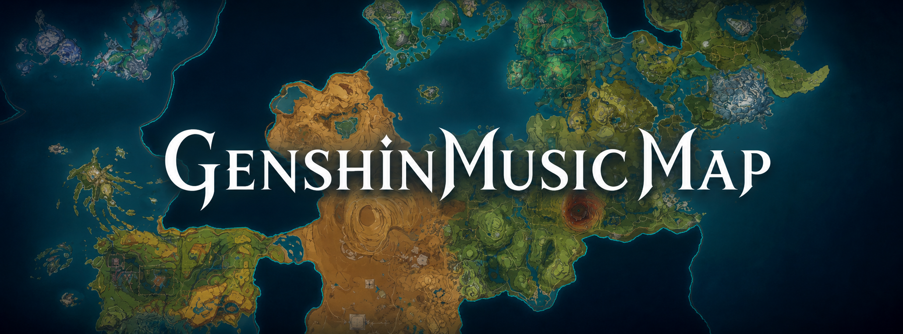

<p align="center">
  
</p>

# GenshinMusicMap v1.0

原神提瓦特音乐地图。项目将交互式瓦片地图、游戏时间系统与地区场景音乐结合，可以在浏览提瓦特地图时按区域和昼夜时段播放对应 BGM。

## 主要功能

- 提瓦特交互地图，支持缩放、区域高亮和国度筛选
- 按 L3 子区域划分可点击范围
- 黎明、白天、黄昏、夜晚四时段游戏时钟
- 区域与时段变化时自动切换对应音乐
- 在线播放、播放控制、循环、音量及淡入淡出
- 唱片播放器与时钟 UI，可分别显示或隐藏

## 当前数据规模

- 6 个国度
- 182 个 L3 地图区域
- 92 个区域已有确认的专属音乐，90 个暂时留空
- 358 条“区域 × 时段”播放映射
- 121 首去重后的在线歌曲
- 3024 张地图瓦片，覆盖 3 个缩放级别

区域与音乐数据仍会随着地图边界补充、游戏版本更新和在线音源状态继续调整。详细的数据报告位于 `doc/` 目录。

## 技术栈

- Vue 3 + Vite
- Leaflet
- 原生 HTML Audio
- CSS / SCSS

## 本地运行

```bash
npm install
npm run dev
```

生产构建：

```bash
npm run build
```

## 使用声明

本项目仅用于个人学习与交流，不用于商业用途，也不代表米哈游、HOYO-MiX 或任何音乐平台。

仓库不收录、不下载、不分发原神音乐音频文件；歌曲通过第三方音乐平台提供的在线地址播放，能否播放取决于平台服务、地区及版权策略。游戏名称、地图、美术、音乐及相关素材的权利归其各自权利人所有。
